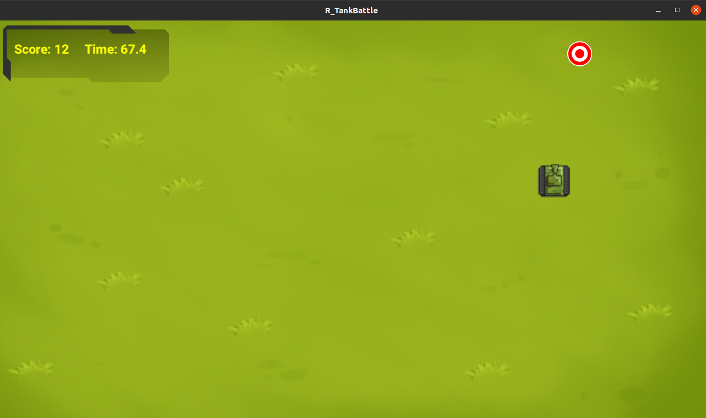

# R_TankBattle 🎮
A simple tank game that is written in Rust using the Piston framework

## Player Controls:
- Moving: <kbd>UP</kbd>, <kbd>DOWN</kbd>, <kbd>LEFT</kbd>, <kbd>RIGHT</kbd>, 
- Turret rotation: <kbd>S</kbd>, <kbd>D</kbd>, 
- Fire: <kbd>SPACE</kbd>
